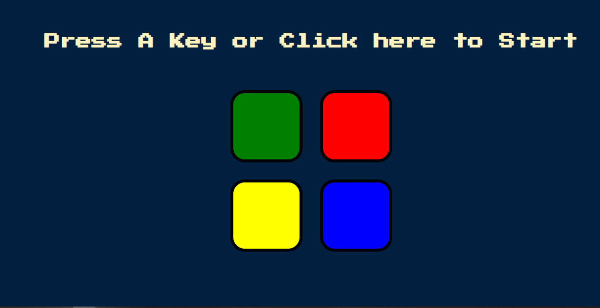
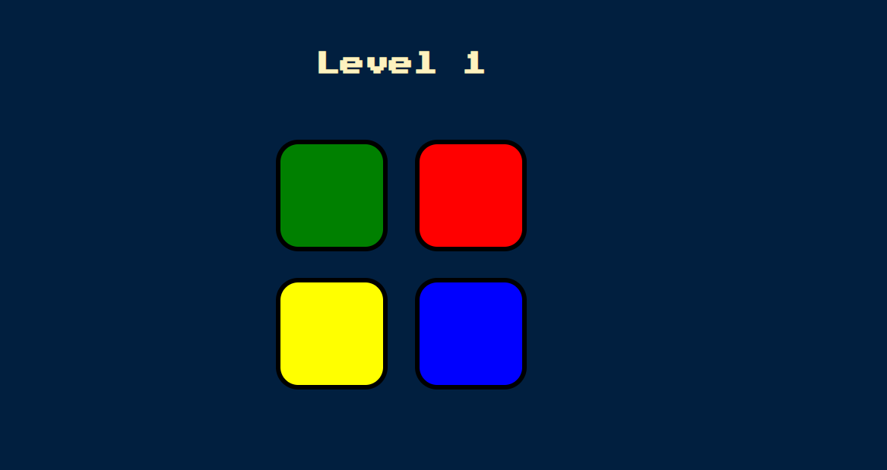
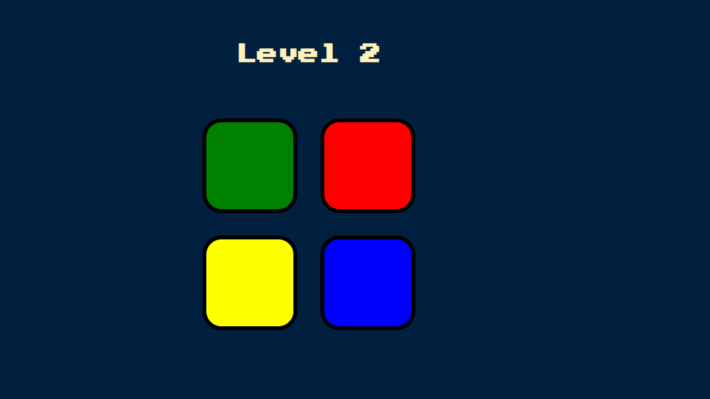
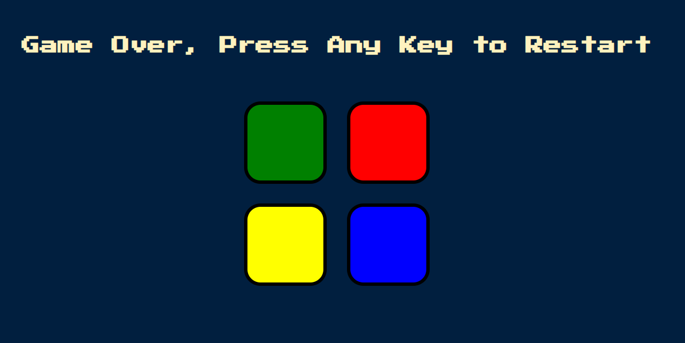

# SimonGame

1.  SimonGame is an electronic game of memory skill.It is built for testing memory skills of users.
    This project was done to give users same experince of SimonGame Device without purchaging the device.

    The game creates a series of tones and lights and requires a user to repeat the sequence. 
    If the user succeeds, the series becomes progressively longer and more complex.    
    Once the user fails the game is over.Users have to restart the game.
  
    
 2. How to use it:
    To use this game user can open index.html file located in source code folder
    or redirect to the link: https://mirzamehrabuddin.github.io/SimonGame/ via a web browser.
    Press Any Key or click on the text shown in the page to start the game.
    Remember the Colour patters serially comes one after another.
    Click the colors shown on the page according to the pattern.
    If your clicked patters matches, game level will increase.
    If you make any mistake, you lost the game and you have to restart the game.
    You can check how many level can you pass!!!!!
 
 
    ScreenShots:
    
    
    
    
    
    
    
    Presentation Video Link:
    https://youtu.be/29q-J6ex-8g
   
    
 3. To configure this project users need a basic Web Browser in PC or Mobile.
    This project was built using HTML,CSS,Javascript,JQuery
    To use this game user can open index.html file in source code folder
    or redirect to the link: https://mirzamehrabuddin.github.io/SimonGame/
